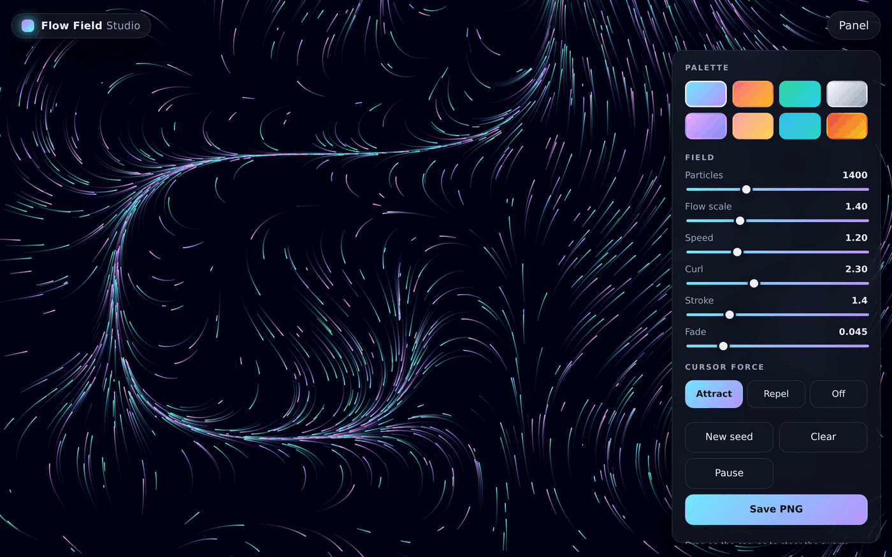

# Flow Field Studio

An interactive generative-art studio that runs entirely in your browser. Thousands of particles drift through a seeded Perlin-style **flow field**, leaving fading trails that bloom into organic, ever-changing artwork. Tune the field, steer the swarm with your cursor, and export a poster-quality PNG.

**▶ Live demo:** https://flowfield--picunblin-s-server.duet.so/



## Features

- **Real-time flow field** — particles are advected through 3D value noise that slowly evolves over time, so the piece never stops changing.
- **Eight curated palettes** — Aurora, Ember, Verdant, Mono, Candy, Sunset, Ocean, and Magma.
- **Live controls** — particle count, flow scale, speed, curl, stroke width, and trail fade, all adjustable on the fly.
- **Cursor force** — drag on the canvas to attract or repel the swarm.
- **Reproducible seeds** — "New seed" reshapes the entire field; the PRNG is seedable so a field can be recreated.
- **One-click PNG export** — save the current frame at full resolution.
- **Zero dependencies, zero network** — one HTML file, one stylesheet, one script. Everything runs locally.
- **Responsive + theming** — works on phones, supports light/dark via the OS preference or a `?theme=` query param.

## Keyboard shortcuts

| Key     | Action      |
| ------- | ----------- |
| `Space` | Play / pause |
| `R`     | New seed     |
| `C`     | Clear canvas |
| `S`     | Save PNG     |

## Run locally

No build step. Just serve the folder with any static server:

```bash
# Python
python3 -m http.server 8000

# or Node
npx serve .
```

Then open `http://localhost:8000`.

## Desktop app (Windows `.exe`)

A native desktop build is available via an [Electron](https://www.electronjs.org/) wrapper in [`desktop/`](desktop/). It runs the exact same canvas app in its own window, fully offline.

```bash
cd desktop
npm install
npm run dist:win   # -> desktop/dist/FlowFieldStudio-portable-1.0.0.exe
```

The result is a single self-contained **portable `.exe`** (x64) — no installation, just double-click. Building Windows targets from Linux/macOS requires [Wine](https://www.winehq.org/); on Windows no extra tooling is needed. See [`desktop/README.md`](desktop/README.md) for details and the NSIS-installer variant.

## How it works

Each particle samples a smoothly-varying noise field at its position to get a flow angle, steps forward along that angle, and draws a short line segment. A faint translucent wash is painted over the canvas every frame, so older segments fade out and create the characteristic streaking trails. The noise field's third dimension is animated over time, which makes the whole field slowly breathe. See [`app.js`](app.js) — it is small and commented.

## Tech

Plain HTML, CSS, and vanilla JavaScript with the Canvas 2D API. No frameworks, no dependencies.

## License

[MIT](LICENSE)
